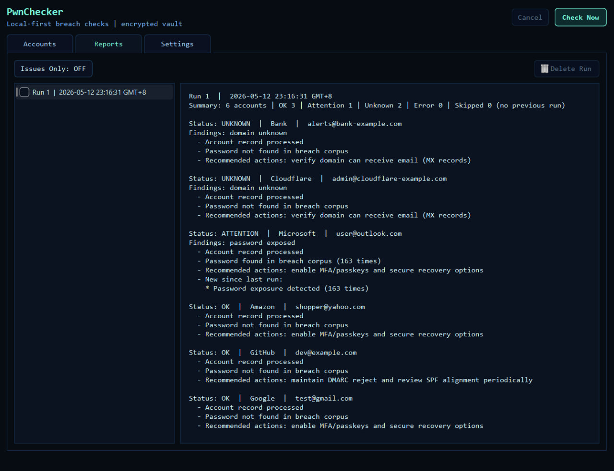

# PwnChecker

Started as a simple itch: too many accounts spread across too many services, and no easy way to do a quick check-in once in a while. PwnChecker keeps a small list of accounts in an encrypted vault, then `Check Now` generates a local report that highlights anything worth paying attention to. It also includes a domain posture check that gives practical “recommended actions” based on how the email domain is configured.




## What Is Implemented
- Desktop GUI (PySide6) with encrypted SQLite vault (master password + field-level encryption).
- Accounts storage (add/edit/delete + checkbox batch delete + filter + persistent sorting).
- `Check Now` produces persisted runs and a textual report:
  - Password exposure check (HIBP Pwned Passwords, k-anonymity).
  - Email domain security posture check (MX/SPF/DMARC via DNS).
- `Check Now` shows status + progress bar and a Cancel action (UI is locked during checks to prevent edits).
- Reports history with checkbox batch delete.
- Settings (encrypted in vault):
  - Report redaction (affects existing reports immediately after save).
  - Remember password hashes (derived SHA-1, encrypted; controls prompting behavior).
- CLI (secondary): `init/add/list/show/remove`.

## Run

## Windows EXE
GitHub Releases include a Windows build as `PwnChecker.exe` (uploaded as a `.zip`).

1. Download the latest `PwnChecker-windows.zip` from Releases.
2. Extract the zip.
3. Run `PwnChecker.exe`.

```powershell
python -m pip install -e .[dev]
python -m pwnchecker.gui
```

Use a local data directory for testing:

```powershell
$env:PWNCHECKER_DATA_DIR = "$pwd\.localdata"
python -m pwnchecker.gui
```

## Docs
- See `USERGUIDE.md` for usage.
- See `DEVGUIDE.md` and `DEVELOPMENT.md` for development practices.
